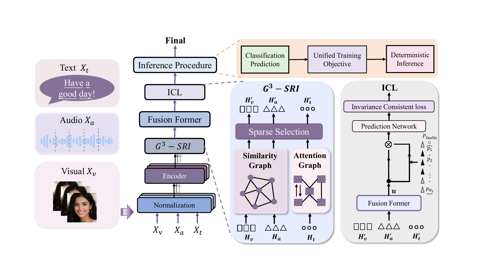

# GS3-ICL

<p align="center">
  <a href="https://www.python.org/"></a>
  <a href="https://pytorch.org/"></a>
  <a href="./LICENSE"></a>
  <a href="./fig/method.png"></a>
</p>

This repository provides a PyTorch implementation of **GS3-ICL**, a multimodal emotion recognition framework for robust speech emotion recognition.

GS3-ICL regularizes each modality before fusion, induces modality-specific graph structures, performs structure-aware sparse token selection, and learns invariant fused representations under perturbation and missing-modality views.

## Overview

<p align="center">
  
</p>

The method is organized around three stages:

1. **Normalized aligned features.** Audio, visual, and text inputs are locally normalized and encoded as token sequences.
2. **Graph-structured sparse selection.** Intra-modal graphs guide structure-preserving token selection before multimodal fusion.
3. **Invariance-consistent learning.** Complementary perturbation views encourage stable fused representations.

During inference, GS3-ICL follows a deterministic path: normalization, encoding, graph propagation, sparse selection, fusion, and classification.

## Project Structure

```text
GS3-ICL/
├── __init__.py          # Package exports
├── gs3_icl/             # Package import shim
├── audio.py             # Audio loading and feature utilities
├── data.py              # Dataset loading and sample construction
├── model.py             # GS3-ICL model implementation
├── paths.py             # Project-relative path helpers
├── train.py             # Training entry module
├── training.py          # Training loop, metrics, and checkpoints
├── dataset/             # Dataset notes and local data directory
├── fig/                 # Method figures
├── scripts/             # Data preparation and run scripts
├── pyproject.toml       # Project metadata
└── setup.py             # Legacy setup entry
```

The core implementation files live at the project root. The `gs3_icl/` package entry exposes them under the `gs3_icl` import namespace.

## Environment

The implementation uses PyTorch. Feature extraction also relies on common audio/video processing tools available in the local environment.

Run project commands from the repository root so the `gs3_icl` import namespace can resolve the root-level implementation modules.

## Data

Dataset information follows the benchmarks used in the paper and is summarized in [dataset/README.md](./dataset/README.md). Raw datasets and generated features are expected to stay outside version control when redistribution is restricted or file size is large.

## Acknowledgement

This project is implemented with PyTorch and follows a compact research-code layout.

## Citation

If you find this project useful, please consider citing:

```bibtex
@inproceedings{zhou2026gs3icl,
  author = {Zhou, Yufan and Ma, Zhiyuan and Wang, Lei and Ren, Hongrui and Zhong, Zhuolun and Wang, Shangpeng and Zhang, Chenyuan and Yang, Haoran},
  title = {{GS$^3$-ICL}: Graph-Structured Sparse Selection with Invariance-Consistent Learning for Multimodal SER},
  booktitle = {Proceedings of the International Conference on Multimedia Retrieval},
  series = {ICMR '26},
  year = {2026},
  location = {Amsterdam, Netherlands},
  publisher = {Association for Computing Machinery},
  address = {New York, NY, USA},
  numpages = {10},
  doi = {10.1145/3805622.3810766},
  url = {https://doi.org/10.1145/3805622.3810766}
}
```
